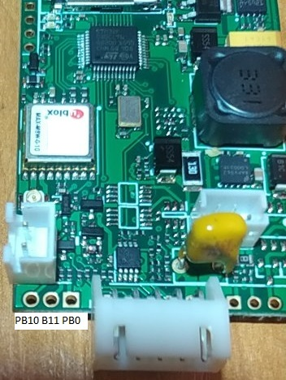
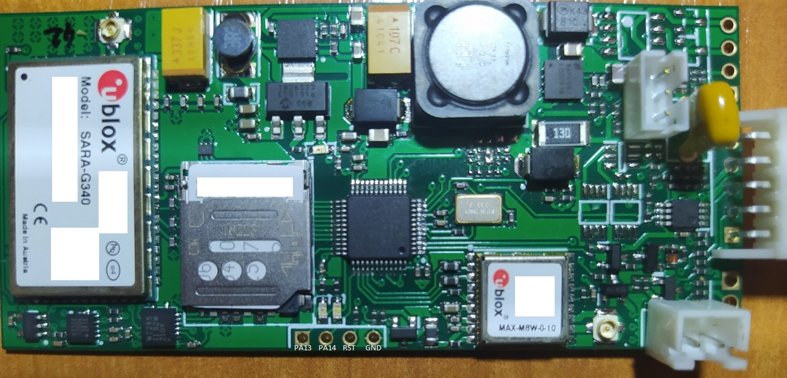

# blinkee-iot-board-reverse

Hardware reverse-engineering notes for a fleet e-scooter IoT / telematics board based on **STM32F030CCT6**, **u-blox SARA-G340**, **u-blox MAX-M8W**, and **KX124 accelerometer**.

> Focus: **PCB hardware mapping, pinout, signal tracing, and subsystem documentation**.
> This repository documents the **board architecture only**.
---


---
# 📦 Main components

* **MCU:** STM32F030CCT6
* **Cellular modem:** u-blox SARA-G340
* **GNSS:** u-blox MAX-M8W
* **Accelerometer:** KX124
* **Level shifter:** SN74AVC4T245PWT
* **Alarm output:** onboard siren connector
* **ESC interface:** 5-pin scooter harness
* **Backup battery:** 7.2 V

---

# 🧠 STM32F030CCT6 full pin map

```text
[ GPS / GNSS  - MAX-M8W ]
PB5   -> GPS_EN / GNSS power transistor enable
PB4   -> GPS_UART_TX  -> MAX-M8W RX
PB3   -> GPS_UART_RX  <- MAX-M8W TX
PA15  -> GPS_TIMEPULSE <- MAX-M8W TIMEPULSE

[ ACCELEROMETER - KX124 ]
PB14  -> ACCEL_SDA (I2C)
PB13  -> ACCEL_SCL (I2C)
PB12  -> ACCEL_INT1
PB15  -> ACCEL_INT2
ADDR   = 0x1E (SDO/SA0 -> GND)

[ SCOOTER / ESC INTERFACE ]
PC13  -> WAKEUP_OUT / POWERUP_SCOOTER
PA4   -> SCOOTER_UART_A
PA5   -> SCOOTER_UART_B

[ ALARM ]
PC14  -> SIREN_PIN

[ POWER / ADC ]
PA0   -> IOT_BACKUP_BATTERY_VOLTAGE (7.2V)
PA1   -> MAIN_BATTERY_VOLTAGE (42V) [probable]

[ MODEM - SARA-G340 DIRECT ]
PA11  -> SARA_RESET_N
PA12  -> SARA_PWR_ON

[ MODEM - UART / FLOW via SN74AVC4T245PWT ]
PA9   -> WT245 1A1
PA10  -> WT245 2A1
PA8   -> WT245 2A2
GND   -> WT245 1A2

WT245 1B1 -> SARA TXD
WT245 1B2 -> UNKNOWN / likely extra control
WT245 2B1 -> SARA RXD
WT245 2B2 -> SARA CTS

[ TEST / SERVICE / FACTORY PADS ]
PB0   -> TEST / CONFIG / SERVICE SELECT ?
PB10  -> SERVICE UART / FACTORY CONFIG ?
PB11  -> SERVICE UART / FACTORY CONFIG ?

[ CLOCK ]
PF0   -> HSE OSC_IN  8MHz
PF1   -> HSE OSC_OUT 8MHz
```

---

# 🔌 5-pin ESC connector

```text
Bottom -> Top
1 -> GND
2 -> UART A
3 -> UART B
4 -> WAKEUP
5 -> VCC 42V MAIN BATTERY
```

---

# 📡 Modem architecture

The **SARA-G340** is controlled by:

* direct power control (`PA12`)
* hardware reset (`PA11`)
* UART through **SN74AVC4T245PWT**
* hardware flow control line (`CTS`)

This strongly suggests:

* AT command transport
* bootloader / config download
* remote telemetry
* robust socket communication

---

# 📳 Motion / anti-theft subsystem

The **KX124 accelerometer** is connected over I²C and exposes:

* `INT1` -> PB12
* `INT2` -> PB15

Likely used for:

* motion wake-up
* tilt detection
* tamper alarm
* theft movement detection
* wake GNSS + modem path

---

# 🛰️ GNSS subsystem

The MAX-M8W block includes:

* switched power rail
* UART
* timepulse sync line

This likely supports:

* live position tracking
* timestamp sync
* theft recovery
* ride history logging

---

# 🧪 Unknown / TODO

* confirm `PA1` as main 42V ADC divider
* identify `WT245 1B2`
* verify exact UART direction labels for modem
* determine `PB0 / PB10 / PB11` factory interface
* inspect bootloader AT initialization flow

---

# ⚠️ Scope

This repository is intended for:

* board documentation
* hardware research
* pin mapping
* repair support
* educational reverse engineering

It intentionally excludes:

* backend endpoints
* credentials
* active fleet configuration blobs
* cloud provisioning data

---

# 📸 Suggested repository structure

```text
images/
notes/
pinout/
modem/
gps/
accelerometer/
factory-pads/
```

---

# 🚀 Status

Current reverse status:

* ✅ GNSS mapped
* ✅ accelerometer mapped
* ✅ modem core lines mapped
* ✅ ESC connector mapped
* ✅ power control mapped
* 🟡 factory pads under investigation
* 🟡 bootloader behavior under analysis
